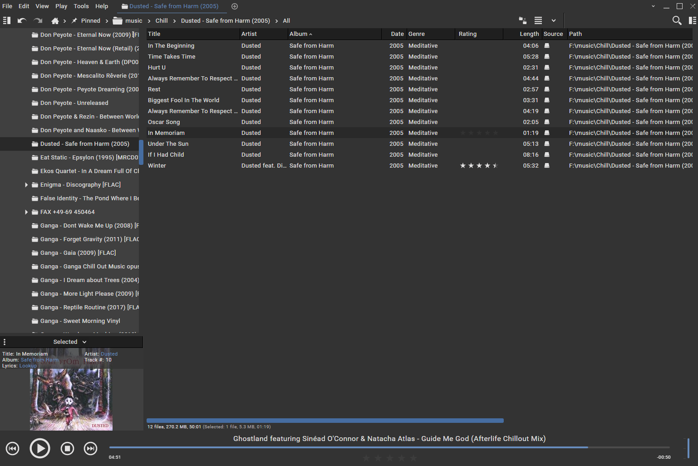
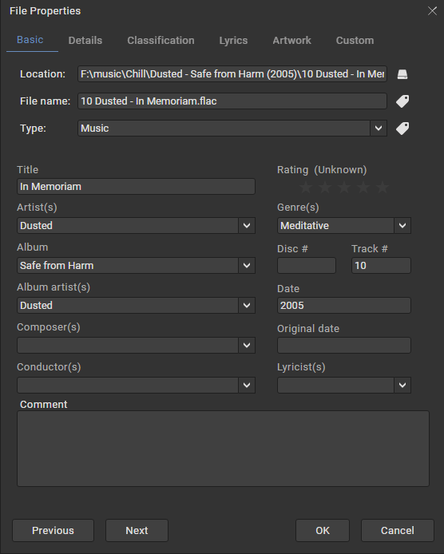

# Media Monkey 5 - Dark Node

Made with Media Monkey 5.0.0.2262

## Changes

- darkened the text so it wasn't so bright
- greys are different from the included `Material Theme Dark`
- increased the padding in menus and tree list to make them easier to read
- removed all dropshadows
- added some hover styling to play bar

## How to install

Place the zip file into the MediaMonkey 5 skins directory.

```powershell
# Example
C:\Portables\MediaMonkey 5\skins\Dark Node v1.0.0.zip
```

## Images



